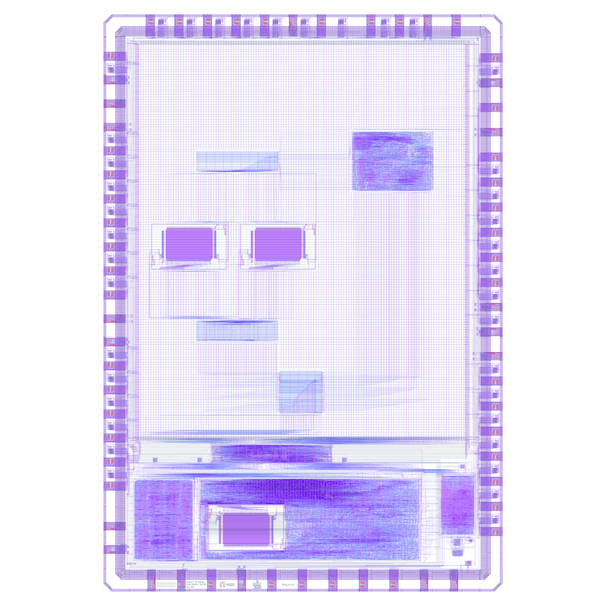
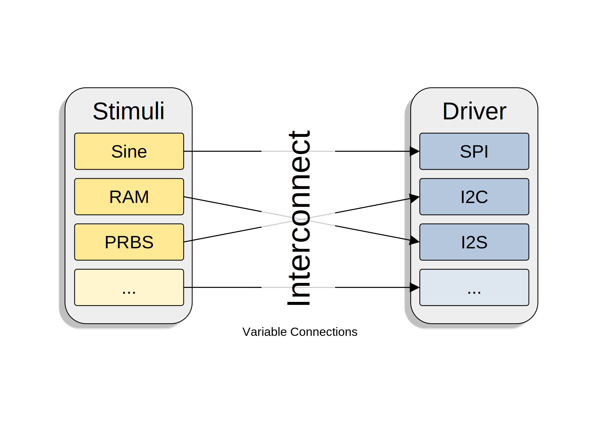

# Caravel User Project

  

# Waveform Generator

The source files for the Waveform Generator can be found under the [waveform-generator](https://github.com/semify-eda/waveform-generator) repository.

The general idea is that various stimuli can be arbitrarily connected to different driver.

Currently the following blocks are implemented:

### Stimuli

- `wfg_stim_sine`
- `wfg_stim_mem`

### Driver

- `wfg_drive_spi`
- `wfg_drive_pat`

### Various

- `wfg_interconnect`
- `wfg_core`
- `wfg_subcore`

## Memory Map

The base address of the user project is `0x30000000`.

By adding an offset to this base address, the various peripherals can be configured.

For more information about the register entries please refer to the [waveform-generator](https://github.com/semify-eda/waveform-generator) repository.

### wfg_core

| Offset | Name   | Description                                    |
|--------|--------|------------------------------------------------|
| 0x10   | CTRL   | Core control register                          |
| 0x14   | CFG    | Core configuration register                    |

### wfg_subcore

| Offset | Name   | Description                                    |
|--------|--------|------------------------------------------------|
| 0x20   | CTRL   | Subcore control register                       |
| 0x24   | CFG    | Subcore configuration register                 |

### wfg_interconnect

| Offset | Name   | Description                                    |
|--------|--------|------------------------------------------------|
| 0x30   | CTRL   | Control register for interconnect              |
| 0x34   | DRIVER0| Driver configuration register                  |
| 0x38   | DRIVER1| Driver configuration register                  |

### wfg_stim_sine

| Offset | Name   | Description                                    |
|--------|--------|------------------------------------------------|
| 0x40   | CTRL   | Control register for sine wave generation unit |
| 0x44   | INC    | Increment register                             |
| 0x48   | GAIN   | Gain register                                  |
| 0x4C   | OFFSET | Offset register                                |

### wfg_stim_mem

| Offset | Name   | Description                                    |
|--------|--------|------------------------------------------------|
| 0x50   | CTRL   | Control register for memory unit               |
| 0x54   | START  | Start register                                 |
| 0x58   | END    | End register                                   |
| 0x5C   | CFG    | Configuration register                         |

### wfg_drive_spi

| Offset | Name   | Description                                    |
|--------|--------|------------------------------------------------|
| 0x60   | CTRL   | Control register for SPI unit                  |
| 0x64   | CFG    | SPI configuration register                     |
| 0x68   | CLKCFG | SPI clock configuration register               |

### wfg_drive_pat

| Offset | Name   | Description                                    |
|--------|--------|------------------------------------------------|
| 0x70   | CTRL   | Control register for pattern unit              |
| 0x74   | CFG    | Pattern configuration register                 |
| 0x78   | PATSEL0| Low bits of PATSEL                             |
| 0x7C   | PATSEL1| High bits of PATSEL                            |

